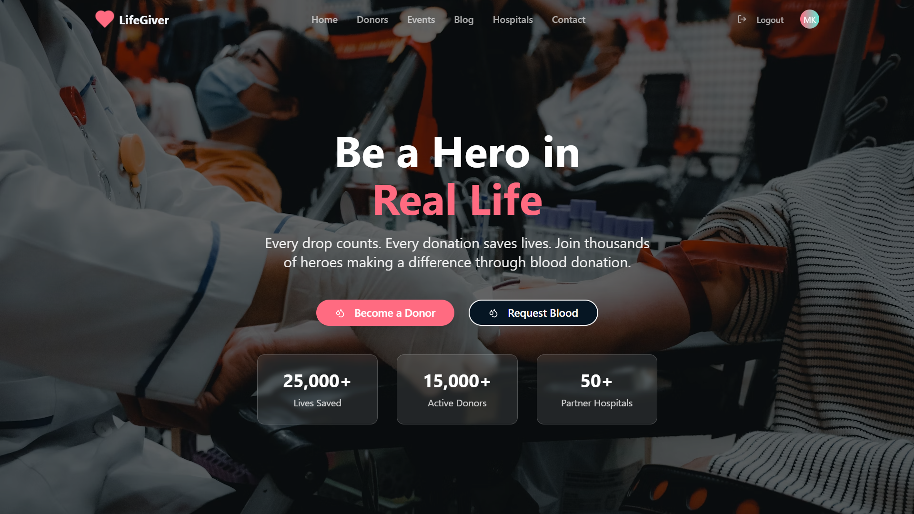
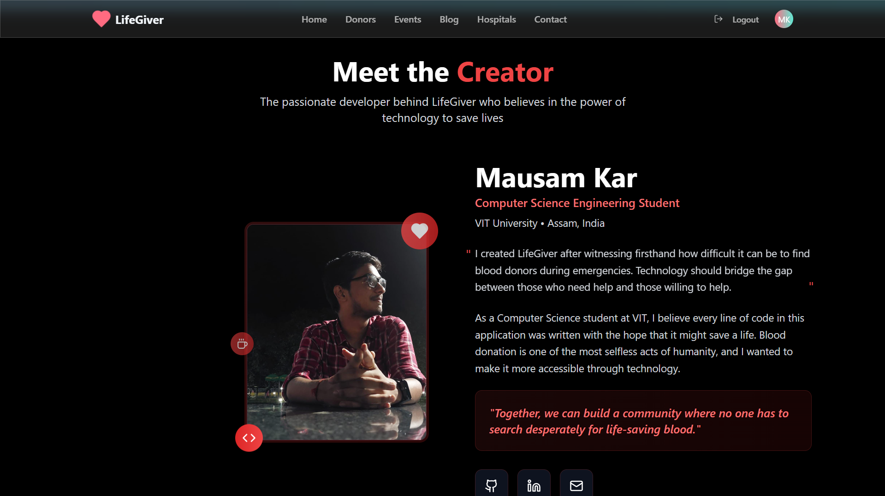

# 🩸 Blood Bank Management System

[](https://blood-bank-management-gamma.vercel.app/)
[](LICENSE)
[](https://react.dev/)
[](https://www.typescriptlang.org/)
[](https://tailwindcss.com/)

---



---

## 🌐 Live Demo

**Website:** [https://blood-bank-management-gamma.vercel.app/](https://blood-bank-management-gamma.vercel.app/)

---

## 📖 Project Overview

Blood Bank Management System is a modern, full-stack web application designed to streamline the process of blood donation, donor management, and blood requests. The platform connects donors, hospitals, and recipients, making it easier to save lives through efficient blood management.

---

## 🚀 Features

| Feature                | Description                                                                 |
|------------------------|-----------------------------------------------------------------------------|
| Donor Registration     | Easy sign-up and profile management for blood donors.                        |
| Blood Request          | Request blood for emergencies and track request status.                      |
| Donor Directory        | Search and filter donors by blood type, location, and availability.          |
| Hospital Management    | Hospitals can manage blood requests and donor lists.                         |
| Event Hosting          | Organize and promote blood donation events.                                  |
| Blog & Resources       | Educational blog posts and resources about blood donation.                   |
| Authentication         | Secure login and registration for users and hospitals.                       |
| Responsive UI          | Mobile-friendly, modern design using Tailwind CSS and shadcn-ui.             |
| Analytics              | Donor and request statistics dashboard.                                      |

---

## 🛠️ Tech Stack

- **Frontend:** React, TypeScript, Vite
- **UI:** Tailwind CSS, shadcn-ui
- **State Management:** React Query
- **Backend/DB:** Supabase
- **Deployment:** Vercel

---

## 🖼️ Preview Images

| Home Page                | Dashboard Page             |
|--------------------------|---------------------------|
|  |  |

---

## ⚡ Getting Started

### Prerequisites
- Node.js & npm (recommended: use [nvm](https://github.com/nvm-sh/nvm#installing-and-updating))

### Setup
```sh
# 1. Clone the repository
git clone <YOUR_GIT_URL>
cd Blood-Bank-Management

# 2. Install dependencies
npm install

# 3. Start the development server
npm run dev
```

---

## 🌍 Deployment

This project is deployed on [Vercel](https://vercel.com/). To deploy your own version:
1. Fork or clone this repository.
2. Push to your GitHub account.
3. Import the repo into Vercel and set up environment variables if needed.

---

## 📄 License

This project is licensed under the MIT License.

---

## 🙏 Contributing

Contributions are welcome! Please open issues or submit pull requests for improvements.

---

## 📣 Credits

- Built with [React](https://react.dev/), [Vite](https://vitejs.dev/), [Tailwind CSS](https://tailwindcss.com/), [Supabase](https://supabase.com/), and [shadcn-ui](https://ui.shadcn.com/).
- Preview images from the project `/public` folder.
